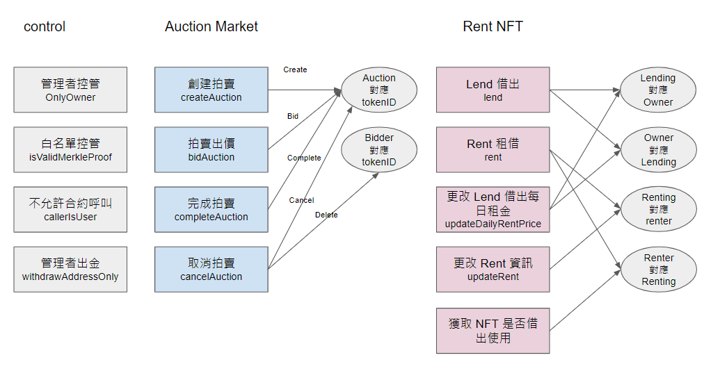

- Project Name: Web3 Game Station  
- Description  
  - purpose  
    - 遊戲裝備生成(單品或者整套)  
    - 遊戲裝備購買與移轉(option-提供最優價格)  
    - 提供遊戲裝備自由交易(option)  
    - 提供遊戲裝備自由交換  
    - 租用遊戲裝備強化角色(option)  
    - 連結元宇宙遊戲  
  - goals  
    - 提供遊戲更好體驗服務  
  - background  
    - 解決傳統遊戲交易問題  
      - 解決傳統只能在單一平台購買遊戲裝備  
      - 解決傳統無法交換裝備  
      - 提供遊戲裝備購改最優價格(option)  
    - 解決傳統遊戲無法提供的服務  
      - 提供閒置或者藍籌遊戲裝備可再利用  
      - 提供遊戲裝備租用服務(option)  
      - 提供更便捷遊戲裝備交換(option)  
  
- Framework  
  - components & responsibilities  
    - Auction Market  
      - ERC721 - one transaction single NFT  
      - ERC721A -  one transaction multiple NFT  
      - Combine Sell - ERC1155  
    - Rent(option)  
      - ERC2615 or reNFT 
  - overall flow  
      
  - [Nice to have] You can use flowcharts or diagrams to visualize the sequence of steps or interactions between components.  
  
- Development  
  - Include step-by-step instructions on how to set up and run the project.  
    - .env.example  
    - command example  
  - If this project includes BE or FE, provide instructions for those as well.  
  
- Testing
  - Explain how to run the tests.  
  - [Nice to have] 80% or more coverage.  
  
- Usage
  - Explain how to use the project and provide examples or code snippets to demonstrate its usage.  